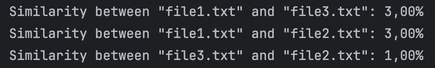

###  Duplicate Finder
— это приложение на Java,предназначенное для поиска дубликатов текстовых файлов в заданной директории с использованием алгоритма MinHash и шинглов.

##  Описание

Программа выполняет следующие шаги:

1. **Загрузка текстов**: Считывает содержимое всех текстовых файлов (`.txt`) из указанной директории.
2. **Канонизация текстов**: Приводит тексты к стандартному виду:
    - Удаляет знаки препинания и специальные символы.
    - Приводит текст к нижнему регистру.
    - Убирает стоп-слова (опционально).
3. **Построение шинглов**: Делит текст на пересекающиеся подстроки (шинглы) заданного размера.
4. **Вычисление MinHash**: Генерирует MinHash для каждого файла для оценки их схожести.
5. **Сравнение файлов**: Сравнивает тексты и выводит процент их схожести.

##  Требования
Java 11 или выше
Apache Commons Codec для алгоритма MurmurHash3
Maven

## Установка и запуск
1. Клонируйте репозиторий: 
git clone https://github.com/vlados2003/duplicate-finder.git

2. Соберите проект: mvn compile
3. Добавьте текстовые файлы в папку input
4. Запустите приложение: 
    
mvn exec:java -Dexec.mainClass="DuplicateFinder.Main"

## Конфигурация
1. Директория с файлами: Укажите путь к директории в переменной directoryPath в Main.java.
2. Размер шинглов: Измените значение shingleSize для определения размера шинглов.
3. Количество хеш-функций: Настройте переменную hashFunctions для изменения точности MinHash.
## Результаты
Программа выводит схожесть файлов в процентах, например:
